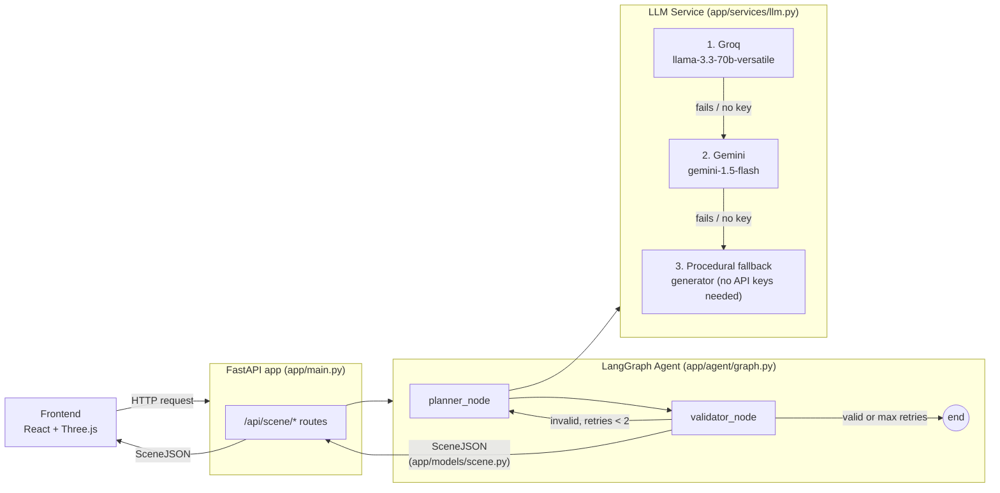
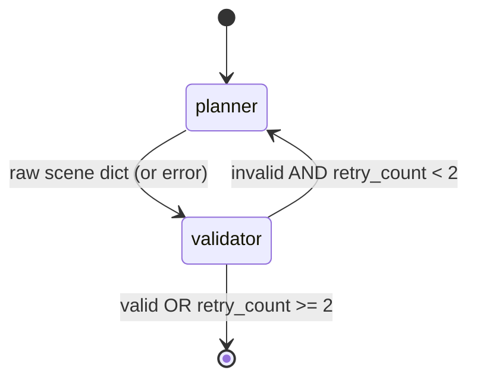

# Crafter D — API

The backend service for **Crafter D**, a natural‑language 3D mini‑game generator. This service takes a plain‑English prompt (e.g. *"a desert dune adventure with ancient stone pillars"*) and returns a structured **`SceneJSON`** document describing a complete, playable 3D mini‑game — terrain, objects, materials, lighting, and win conditions — which the [frontend](../Crafter-D-frontend-main) renders in the browser with Three.js.

> Frontend repo: `Crafter-D-frontend` — see its README for the rendering pipeline and UI.

---

## Table of Contents

- [How it works](#how-it-works)
- [Tech stack](#tech-stack)
- [Architecture](#architecture)
- [Project structure](#project-structure)
- [The Scene JSON contract](#the-scene-json-contract)
- [API reference](#api-reference)
- [Getting started](#getting-started)
- [Environment variables](#environment-variables)
- [Current status & roadmap](#current-status--roadmap)

---

## How it works

1. The frontend sends a natural‑language prompt to the API.
2. A **LangGraph** agent (`planner → validator` loop) takes the prompt, sends it to an LLM with a strict system prompt describing the game‑design rules, and gets back raw JSON.
3. The raw JSON is validated against a **Pydantic** schema (`SceneJSON`). If it fails validation, the agent loops back to the planner and retries (up to 2 times) before giving up.
4. The LLM call itself is resilient: it tries **Groq** (`llama-3.3-70b-versatile`) first, falls back to **Gemini** (`gemini-1.5-flash`) if Groq fails or no key is set, and finally falls back to a **deterministic procedural generator** if neither API key is configured — so the whole pipeline always returns a valid scene, even with zero external dependencies configured.
5. The validated `SceneJSON` is returned to the frontend as the response body.

## Tech stack

| Layer | Technology | Why |
|---|---|---|
| Web framework | **FastAPI** | Async, auto-generated OpenAPI docs, native Pydantic integration |
| Server | **Uvicorn** | ASGI server for FastAPI |
| Schema / validation | **Pydantic v2** | Single source of truth for the `SceneJSON` contract; guarantees the frontend never receives malformed data |
| Agent orchestration | **LangGraph** | Models the "generate → validate → retry" loop as an explicit state machine instead of ad-hoc try/except chains |
| LLM providers | **langchain-groq** (primary), **langchain-google-genai** (fallback) | Fast, cheap primary inference with a fallback provider for resilience |
| Object storage (planned) | **boto3** targeting **Cloudflare R2** (S3-compatible) | Storing/generating 3D asset files for the `type: "asset"` scene objects |
| Auth / database (planned) | **Supabase** | User accounts and persisting/sharing generated games |
| HTTP client | **httpx** | Async HTTP calls (used by LangChain integrations and future asset-gen calls) |
| Config | **python-dotenv** | Loads API keys and secrets from `.env` |

## Architecture



**Agent state machine detail:**



The agent graph (`build_game_agent_graph`) is compiled once at import time into a module-level singleton, `game_agent_graph`.

## Project structure

```
app/
├── main.py                  # FastAPI app instance, CORS config, router registration
├── models/
│   └── scene.py             # Pydantic schema: SceneJSON, SceneObject, MaterialConfig,
│                             # BehaviorConfig, GameConfig, TerrainConfig
├── api/
│   └── routes/
│       └── scene.py         # /api/scene/* endpoints
├── agent/
│   └── graph.py             # LangGraph state machine: planner_node, validator_node,
│                             # should_continue, build_game_agent_graph()
└── services/
    └── llm.py                # generate_scene_from_llm(): Groq -> Gemini -> procedural fallback
                                # + SYSTEM_PROMPT (game design rules given to the LLM)
requirements.txt
.env.example
```

## The Scene JSON contract

`app/models/scene.py` is the authoritative schema for everything the API can return. It mirrors the TypeScript types in the frontend repo (`src/types/scene.ts`) — **if you change one, change the other.**

```python
class SceneJSON(BaseModel):
    gameConfig: GameConfig        # title, description, cameraMode, win/lose conditions, playerStart
    terrain: Optional[TerrainConfig]   # procedural terrain: size, segments, heightScale, seed, colorScheme
    objects: List[SceneObject]    # player, collectibles, obstacles, platforms...
    environment: Dict[str, Any]   # skyColor, groundColor, ambientLight, directionalLight
```

Each `SceneObject` has a primitive `type` (`box | sphere | cylinder | cone | torus | plane | asset`), a `MaterialConfig` (color/roughness/metalness/emissive), and an optional `BehaviorConfig` (`player | collectible | obstacle | enemy | goal | moving | static`) that tells the frontend how to animate or treat it.

The LLM is instructed (via `SYSTEM_PROMPT` in `llm.py`) to only ever produce objects that satisfy this schema — using primitive geometry only, keeping games short (1–5 min), and following specific rules for collectible counts, object placement heights, and camera modes.

## API reference

Interactive OpenAPI docs are auto-generated by FastAPI at **`/docs`** (Swagger UI) and **`/redoc`** once the server is running.

| Method | Path | Description |
|---|---|---|
| `GET` | `/` | Health check — `{"message": "Crafter D Engine API is active", "status": "online"}` |
| `GET` | `/api/scene/test` | Returns a hardcoded, hand-authored `SceneJSON` ("Pastel Floating Islands") — used by the frontend on load and as a manual "reset" scene |

> **Note:** the LangGraph agent and multi-provider LLM service (`app/agent`, `app/services/llm.py`) are fully implemented but **not yet wired to an HTTP route** — see [Roadmap](#current-status--roadmap).

## Getting started

### Prerequisites
- Python 3.10+
- (Optional) API keys for Groq and/or Gemini — the service works with zero keys configured, using the procedural fallback generator

### Install

```bash
python -m venv .venv
source .venv/bin/activate      # Windows: .venv\Scripts\activate
pip install -r requirements.txt
cp .env.example .env           # then fill in any keys you have
```

### Run

```bash
uvicorn app.main:app --reload --port 8000
```

The API is now available at **http://localhost:8000** (docs at `/docs`). Run the [frontend](../Crafter-D-frontend-main) alongside it — its dev server proxies `/api/*` to this port automatically.

## Environment variables

Defined in `.env.example`:

| Variable | Purpose | Required? |
|---|---|---|
| `GROQ_API_KEY` | Primary LLM provider for scene generation | No — falls back to Gemini, then procedural generation |
| `GEMINI_API_KEY` | Fallback LLM provider | No |
| `TRIPO_API_KEY` / `MESHY_API_KEY` | 3D asset generation providers (for the `type: "asset"` scene objects) | No — reserved for a future milestone |
| `R2_ACCOUNT_ID` / `R2_ACCESS_KEY_ID` / `R2_SECRET_ACCESS_KEY` / `R2_BUCKET_NAME` / `R2_PUBLIC_URL` | Cloudflare R2 (S3-compatible) storage for generated assets | No — reserved for a future milestone |
| `SUPABASE_URL` / `SUPABASE_KEY` | Auth & persistence for saving/sharing generated games | No — reserved for a future milestone |

CORS is currently wide open (`allow_origins=["*"]`) in `main.py` to simplify local development and support both the Vite dev server and a deployed frontend (e.g. Cloudflare Pages). Tighten this to a specific origin list before shipping to production.

## Current status & roadmap

- ✅ **Milestone 1 (current):** FastAPI service scaffolded; `SceneJSON` schema defined; `/api/scene/test` serves a static demo scene; LangGraph agent and 3-tier LLM fallback chain (Groq → Gemini → procedural) implemented and unit-testable in isolation.
- 🔜 **Milestone 2:** Add a `POST /api/scene/generate` route that accepts `{ "prompt": string }`, invokes `game_agent_graph.ainvoke(...)`, and returns the resulting `SceneJSON` (or a clear error if validation ultimately fails after retries).
- 🔜 **Later:** Wire up Tripo/Meshy for real 3D asset generation (`SceneObject.type == "asset"` / `assetUrl`), store generated assets in Cloudflare R2, and use Supabase to persist and let users share generated games via a permalink.

Contributions that add new LLM providers should follow the existing pattern in `app/services/llm.py`: try the new provider, log and fall through on failure, and never let a provider outage prevent a `SceneJSON` from being returned.
